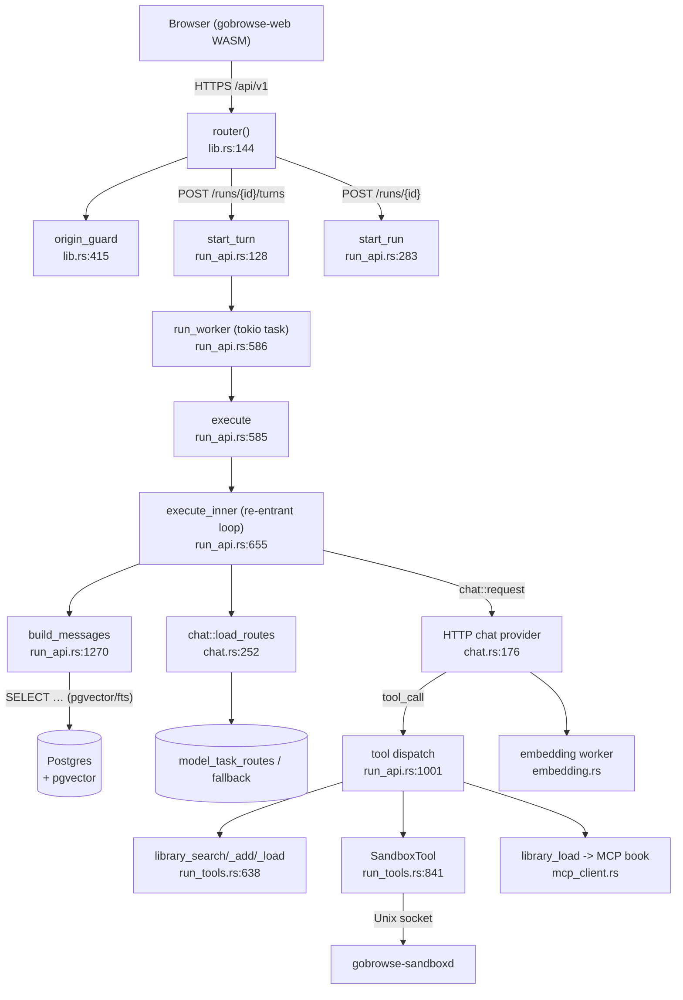
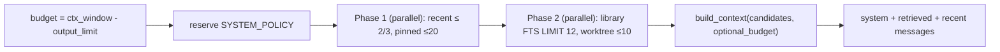
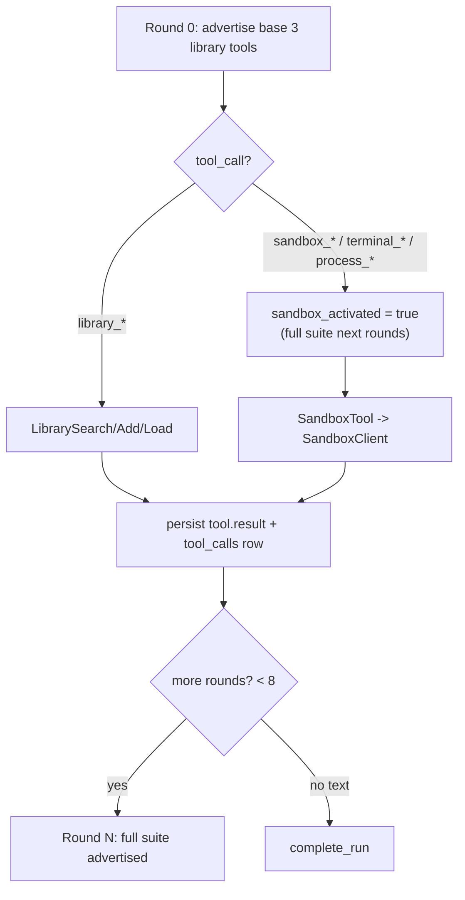
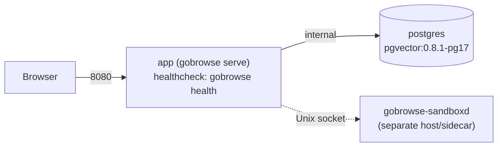

# Architecture Map — Gobrowse OS (M24 baseline)

> **Baseline:** M24 (`8c54539`). This document is a permanent map of the system
> as it stands at the M24 tag. It is grounded in direct code inspection
> (file:line citations). Read-only reference — do not edit to describe future
> work without updating the cited code.

## 1. Crate dependency graph

Gobrowse OS is a Cargo workspace of four crates. `gobrowse-core` is the shared
foundation; `gobrowse-server` (binary `gobrowse`) and `gobrowse-sandboxd`
(daemon) both depend on it via path dependencies. `gobrowse-web` is a
standalone WASM/Leptos frontend compiled to `dist/` and served as static assets
by the server; it is **not** a Cargo dependency of the server and consumes the
server's JSON API over HTTP.

```
gobrowse-core  (pure shared types, no internal deps)
   ├── gobrowse-server  [bin: gobrowse]   (HTTP API + run loop + providers)
   └── gobrowse-sandboxd [bin: sandboxd]  (sandbox/terminal daemon)

gobrowse-web   (WASM / Leptos frontend -> dist/, served by gobrowse-server)
```

Evidence:

- `gobrowse-core` depends only on workspace-agnostic crates
  (`async-trait`, `serde`, `tokio`, `uuid`, `sha2`, `thiserror`, …) —
  `crates/gobrowse-core/Cargo.toml:6-18`. No `path = "../…"` entries.
- `gobrowse-server` depends on `gobrowse-core` via path —
  `crates/gobrowse-server/Cargo.toml:30` (`gobrowse-core = { path = "../gobrowse-core" }`).
  It does **not** depend on `gobrowse-sandboxd` or `gobrowse-web` (the sandbox
  is reached over a Unix socket, not a crate edge).
- `gobrowse-sandboxd` depends on `gobrowse-core` via path —
  `crates/gobrowse-sandboxd/Cargo.toml:11`.
- `gobrowse-web` declares only WASM-target dependencies (`leptos`,
  `gloo-net`, `wasm-bindgen`, `web-sys`, …) and **no** internal crate edge —
  `crates/gobrowse-web/Cargo.toml:9-17`. It is built and bundled as `dist/`,
  which the server serves via `ServeDir` —
  `crates/gobrowse-server/src/lib.rs:392`.

### 2. Module map — `gobrowse-server`

Declared in `crates/gobrowse-server/src/lib.rs:1-32`. Each module and its one-line
responsibility:

| Module | Responsibility |
|--------|----------------|
| `api` | Server metadata + liveness/readiness probes (`version`, `live`, `ready`). |
| `auth` | Owner setup, login/logout, session issuance, session rotation. |
| `autobiography_api` | Agent autobiography policy, manual edits, and review proposals. |
| `chat` | HTTP chat provider (OpenAI/Ollama wire formats) + model-route loading (`load_routes`). |
| `config` | `Settings` loading and typed config structs. |
| `conversation_api` | Conversation CRUD, message append, search, pins, fork. |
| `db` | Postgres pool, connect, and `migrate`. |
| `doctor` | Runtime diagnostics checks (`gobrowse doctor`). |
| `embedding` | Embedding worker + provider HTTP client (network-policy aware). |
| `embedding_api` | Embedding configuration CRUD + activation. |
| `error` | `AppError` taxonomy and HTTP mapping. |
| `library_api` | Book CRUD, lexical search, progressive `load` (body/skill/MCP/plugin). |
| `model_api` | Chat-model CRUD, task-route CRUD, provider auto-detect. |
| `outbound_http` | Validated, pinned transport for outbound webhook delivery. |
| `plugin_api` | Plugin install server flow: preview → approved install → upgrade/rollback. |
| `plugin_github` | GitHub-release plugin `PluginSource` + marketplace adapter (Lane C). |
| `realtime` | Run realtime upgrade (streaming run events to the client). |
| `router` | `AppState` axum `Router` assembly **and** the adaptive capability/model router. |
| `run_api` | Run/turn execution worker, context assembly (`build_messages`), tool loop. |
| `run_tools` | Native tool implementations + wire `ToolDefinition` set (library + sandbox). |
| `sandbox_api` | Sandbox HTTP backend: exec, file manager, PTY terminal, process control. |
| `sandbox_client` | Typed client for the `gobrowse-sandboxd` Unix-socket protocol. |
| `skills_api` | Profile/workspace-scoped Skills and immutable revision lifecycle. |
| `task_api` | Tasks + activity feed. |
| `usage_api` | Provider catalog and model-cost aggregation. |
| `vault` | Secret vault (master-key backed, resolve-for-provider). |
| `vault_api` | Vault secret CRUD + rotation. |
| `webhook_scheduler` | Outbound webhook delivery scheduler. |
| `webhooks` | Inbound webhook receive, signature verify, and dedup. |
| `worktree_api` | Worktree CRUD. |

## 3. Data flow: HTTP → router → run loop → providers/sandbox/MCP



Plain-text summary:

1. The browser (WASM frontend) issues JSON requests to `/api/v1`.
2. `router(state)` (`lib.rs:144-413`) mounts every route and layers
   middleware (`origin_guard`, body limit, timeout, compression, request-id,
   trace, panic-catch).
3. A conversation turn is started via `POST /conversations/{id}/turns`
   (`start_turn`, `run_api.rs:128`) which enqueues a run row; the
   `run_worker` (`run_api.rs:586`) claims the lease and calls `execute` →
   `execute_inner` (`run_api.rs:655`).
4. `execute_inner` first assembles context (`build_messages`,
   `run_api.rs:1270`), then loads model routes (`chat::load_routes`,
   `chat.rs:252`) and opens a streamed chat request.
5. Model `tool_call` events are dispatched in-process: the three library tools
   (`run_tools.rs:638-839`), the sandbox/terminal suite (via `SandboxClient`
   to `gobrowse-sandboxd`), and MCP tools (via `McpClientPool` for MCP books).
6. Results are persisted as run events and the conversation is updated.

## 4. Context assembly flow

Entry point: `build_messages` (`run_api.rs:1270-1559`). It is invoked from
`execute_inner` at `run_api.rs:719` with a `budget` equal to the model context
window minus the output limit (`run_api.rs:724`).

**Budget split**

- `SYSTEM_POLICY` (`run_api.rs:32`) is always the first system message; its
  token estimate is reserved up front (`run_api.rs:1278-1284`).
  `content_budget = budget - policy_tokens`.
- **Recent messages** may consume up to **2/3** of `content_budget`: the loop
  `while recent_tokens_for(&recent) > content_budget * 2 / 3 { recent.remove(0) }`
  (`run_api.rs:1335`). Recent messages are fetched `ORDER BY ordinal DESC LIMIT 40`
  then reversed (`run_api.rs:1302-1337`).
- The **remainder** (`optional_budget = content_budget - recent_tokens`,
  `run_api.rs:1344`) funds retrieved library / worktree / pinned content.
- Implicit library retrieval is capped at **`LIMIT 12`** candidates
  (`run_api.rs:1387`); pinned books `LIMIT 20` (`run_api.rs:1315`); worktrees
  `LIMIT 10` (`run_api.rs:1401`).

**Parallel assembly (M23 carryover)**

`build_messages` issues its independent queries concurrently with
`tokio::try_join!`:

- Phase 1 — workspace id + recent messages + pinned books
  (`run_api.rs:1291-1321`).
- Phase 2 — unified library FTS search + worktree listing
  (`run_api.rs:1368-1410`).

**Candidate selection**

Candidates carry a `priority` (library retrieval `300`, worktree `250`, pinned
`400` — `run_api.rs:1434,1457,1500`) and are passed to
`build_context` (`gobrowse-core/src/context.rs:40`), which selects required
candidates first, then highest-priority optional candidates within the budget
without slicing content. The assembled `snapshot` records selected/omitted ids,
`used_tokens`, `budget`, `recent_messages`, and the `task_class`
(`run_api.rs:1551-1557`).



## 5. Tool execution flow (re-entrant run loop)

`execute_inner` (`run_api.rs:655-1175`) is the agent loop:

- **Bounds:** `max_rounds = 8`, `max_tool_calls = 16`
  (`run_api.rs:796-797`). Exceeding either returns a `tool_limit` error.
- **Lazy sandbox advertisement:** `sandbox_activated` starts `false`
  (`run_api.rs:804`). `active_tool_defs` (`run_api.rs:1183-1200`) advertises
  **only the three base library tools** (`library_search`, `library_add`,
  `library_load` — `run_api.rs:1191-1195`) until a sandbox tool is first used;
  afterward the **full suite** is advertised for the remainder of the run
  (no per-round flicker).
- **Round 0 = base 3 library tools.** The first model request is built with
  `active_tool_defs(&tool_defs, sandbox_activated)` (`run_api.rs:807-811`).
- **First sandbox call flips the switch:** when a model calls a sandbox tool,
  `sandbox_activated = true` is set (`run_api.rs:1065`) and subsequent rounds
  send the full suite.
- **Dispatch:** tool calls are matched by name (`run_api.rs:1001-1089`): the
  three library tools instantiate `LibrarySearchTool` / `LibraryAddTool` /
  `LibraryLoadTool`; any other name is resolved via `sandbox_tool_kind`
  (`run_tools.rs:573`) to a `SandboxTool`; unrecognized names return
  `InvalidInput`.
- **Per-tool timeout:** every tool executes under a 10-second `timeout`
  (`run_api.rs:1015,1032,1050,1080`); on elapse the result becomes
  `ToolError::Timeout`.
- **Tool results** are appended as run events and a `tool_calls` row
  (`run_api.rs:1102-1133`), then folded into the in-flight message history for
  the next round (`run_api.rs:1154-1170`).



## 6. Model routing

Two cooperating pieces:

**Route loading — `chat::load_routes` (`chat.rs:252-367`)**

Builds the ordered chain of chat-capable models. The SQL orders by
`(route.position = 0) DESC, m.cost_ranking ASC NULLS LAST, route.position`
(`chat.rs:272`). This puts the primary model first, then the cheapest
(`cost_ranking` ascending, `NULL` last), then by configured fallback position.
Only providers with a recognized wire format and a resolvable base URL +
credential are kept (`chat.rs:285-344`).

**Task routing — `router::select_model_for_task` (`router.rs:336-381`)**

1. If a `model_task_routes` entry matches the classified `TaskClass`
   (`router.rs:342-349`), that preferred model is used.
2. Otherwise it selects the **cheapest-capable** model from the fallback chain
   via `min_by(cost_ranking).then(position)` (`router.rs:357-360`), preserving
   primary-model-first semantics when costs tie (default `0.0`).

`classify_task` (`router.rs:53-129`) maps the user's text to a `TaskClass`
(`Coding`, `ShellAutomation`, `Research`, `DocumentCreation`, `Ecommerce`,
`GeneralQA`) using deterministic rule patterns. Task classification is run
inside `build_messages` before retrieval (`run_api.rs:1353-1357`).

## 7. Deployment topology

`docker-compose.yml` defines two services:

- **`app`** — built from `Dockerfile`; runs `gobrowse serve` (`docker-compose.yml:4-42`).
  - `read_only: true`, `tmpfs /tmp`, `no-new-privileges`, `cap_drop: ALL`
    (`docker-compose.yml:19-27`).
  - Healthcheck: `gobrowse health` (`docker-compose.yml:29-34`), which probes
    `GET http://127.0.0.1:{GOBROWSE_PORT:-8080}/health/ready`
    (`crates/gobrowse-server/src/main.rs:198-218`) and exits 0 on `200 OK`.
  - Resource limits 384M / 0.75 CPU; networks `edge` + internal `data`.
- **`postgres`** — `pgvector/pgvector:0.8.1-pg17` (`docker-compose.yml:44-76`),
  internal-only network, healthcheck `pg_isready`.

The runtime image is `debian:bookworm-slim` with **only `ca-certificates`**
installed — no `curl` or `git` — because the healthcheck uses the self-contained
`gobrowse health` command instead (`Dockerfile:34-52`). The frontend WASM is
optimized at build time with `wasm-opt -Oz --enable-bulk-memory`
(`Dockerfile:32`).


